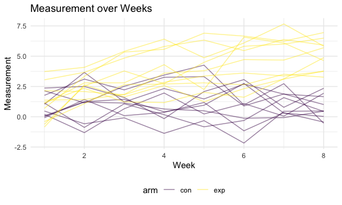

Homework 5
================

## Problem 2

### Clean the data

``` r
tidy_df = 
  tibble(
    files = list.files(path = "data/", full.names = TRUE) 
         ) %>% 
  mutate(data = purrr::map(.x = files, read_csv)) %>% 
  unnest(data) %>% 
  mutate(arm_id = str_extract_all(files, "(exp_\\d+|con_\\d+)")) %>% 
  select(-files) %>% 
  relocate(arm_id) %>% 
  pivot_longer(
             week_1:week_8,
             names_to = "week",
             names_prefix = "week_",
             values_to = "measurement"
             ) %>% 
  mutate_at(vars(week), as.numeric) %>% 
  unnest(arm_id) %>% 
  separate(arm_id, into = c("arm", "subject_id")) 
```

    ## Parsed with column specification:
    ## cols(
    ##   week_1 = col_double(),
    ##   week_2 = col_double(),
    ##   week_3 = col_double(),
    ##   week_4 = col_double(),
    ##   week_5 = col_double(),
    ##   week_6 = col_double(),
    ##   week_7 = col_double(),
    ##   week_8 = col_double()
    ## )
    ## Parsed with column specification:
    ## cols(
    ##   week_1 = col_double(),
    ##   week_2 = col_double(),
    ##   week_3 = col_double(),
    ##   week_4 = col_double(),
    ##   week_5 = col_double(),
    ##   week_6 = col_double(),
    ##   week_7 = col_double(),
    ##   week_8 = col_double()
    ## )
    ## Parsed with column specification:
    ## cols(
    ##   week_1 = col_double(),
    ##   week_2 = col_double(),
    ##   week_3 = col_double(),
    ##   week_4 = col_double(),
    ##   week_5 = col_double(),
    ##   week_6 = col_double(),
    ##   week_7 = col_double(),
    ##   week_8 = col_double()
    ## )
    ## Parsed with column specification:
    ## cols(
    ##   week_1 = col_double(),
    ##   week_2 = col_double(),
    ##   week_3 = col_double(),
    ##   week_4 = col_double(),
    ##   week_5 = col_double(),
    ##   week_6 = col_double(),
    ##   week_7 = col_double(),
    ##   week_8 = col_double()
    ## )
    ## Parsed with column specification:
    ## cols(
    ##   week_1 = col_double(),
    ##   week_2 = col_double(),
    ##   week_3 = col_double(),
    ##   week_4 = col_double(),
    ##   week_5 = col_double(),
    ##   week_6 = col_double(),
    ##   week_7 = col_double(),
    ##   week_8 = col_double()
    ## )
    ## Parsed with column specification:
    ## cols(
    ##   week_1 = col_double(),
    ##   week_2 = col_double(),
    ##   week_3 = col_double(),
    ##   week_4 = col_double(),
    ##   week_5 = col_double(),
    ##   week_6 = col_double(),
    ##   week_7 = col_double(),
    ##   week_8 = col_double()
    ## )
    ## Parsed with column specification:
    ## cols(
    ##   week_1 = col_double(),
    ##   week_2 = col_double(),
    ##   week_3 = col_double(),
    ##   week_4 = col_double(),
    ##   week_5 = col_double(),
    ##   week_6 = col_double(),
    ##   week_7 = col_double(),
    ##   week_8 = col_double()
    ## )
    ## Parsed with column specification:
    ## cols(
    ##   week_1 = col_double(),
    ##   week_2 = col_double(),
    ##   week_3 = col_double(),
    ##   week_4 = col_double(),
    ##   week_5 = col_double(),
    ##   week_6 = col_double(),
    ##   week_7 = col_double(),
    ##   week_8 = col_double()
    ## )
    ## Parsed with column specification:
    ## cols(
    ##   week_1 = col_double(),
    ##   week_2 = col_double(),
    ##   week_3 = col_double(),
    ##   week_4 = col_double(),
    ##   week_5 = col_double(),
    ##   week_6 = col_double(),
    ##   week_7 = col_double(),
    ##   week_8 = col_double()
    ## )
    ## Parsed with column specification:
    ## cols(
    ##   week_1 = col_double(),
    ##   week_2 = col_double(),
    ##   week_3 = col_double(),
    ##   week_4 = col_double(),
    ##   week_5 = col_double(),
    ##   week_6 = col_double(),
    ##   week_7 = col_double(),
    ##   week_8 = col_double()
    ## )
    ## Parsed with column specification:
    ## cols(
    ##   week_1 = col_double(),
    ##   week_2 = col_double(),
    ##   week_3 = col_double(),
    ##   week_4 = col_double(),
    ##   week_5 = col_double(),
    ##   week_6 = col_double(),
    ##   week_7 = col_double(),
    ##   week_8 = col_double()
    ## )
    ## Parsed with column specification:
    ## cols(
    ##   week_1 = col_double(),
    ##   week_2 = col_double(),
    ##   week_3 = col_double(),
    ##   week_4 = col_double(),
    ##   week_5 = col_double(),
    ##   week_6 = col_double(),
    ##   week_7 = col_double(),
    ##   week_8 = col_double()
    ## )
    ## Parsed with column specification:
    ## cols(
    ##   week_1 = col_double(),
    ##   week_2 = col_double(),
    ##   week_3 = col_double(),
    ##   week_4 = col_double(),
    ##   week_5 = col_double(),
    ##   week_6 = col_double(),
    ##   week_7 = col_double(),
    ##   week_8 = col_double()
    ## )
    ## Parsed with column specification:
    ## cols(
    ##   week_1 = col_double(),
    ##   week_2 = col_double(),
    ##   week_3 = col_double(),
    ##   week_4 = col_double(),
    ##   week_5 = col_double(),
    ##   week_6 = col_double(),
    ##   week_7 = col_double(),
    ##   week_8 = col_double()
    ## )
    ## Parsed with column specification:
    ## cols(
    ##   week_1 = col_double(),
    ##   week_2 = col_double(),
    ##   week_3 = col_double(),
    ##   week_4 = col_double(),
    ##   week_5 = col_double(),
    ##   week_6 = col_double(),
    ##   week_7 = col_double(),
    ##   week_8 = col_double()
    ## )
    ## Parsed with column specification:
    ## cols(
    ##   week_1 = col_double(),
    ##   week_2 = col_double(),
    ##   week_3 = col_double(),
    ##   week_4 = col_double(),
    ##   week_5 = col_double(),
    ##   week_6 = col_double(),
    ##   week_7 = col_double(),
    ##   week_8 = col_double()
    ## )
    ## Parsed with column specification:
    ## cols(
    ##   week_1 = col_double(),
    ##   week_2 = col_double(),
    ##   week_3 = col_double(),
    ##   week_4 = col_double(),
    ##   week_5 = col_double(),
    ##   week_6 = col_double(),
    ##   week_7 = col_double(),
    ##   week_8 = col_double()
    ## )
    ## Parsed with column specification:
    ## cols(
    ##   week_1 = col_double(),
    ##   week_2 = col_double(),
    ##   week_3 = col_double(),
    ##   week_4 = col_double(),
    ##   week_5 = col_double(),
    ##   week_6 = col_double(),
    ##   week_7 = col_double(),
    ##   week_8 = col_double()
    ## )
    ## Parsed with column specification:
    ## cols(
    ##   week_1 = col_double(),
    ##   week_2 = col_double(),
    ##   week_3 = col_double(),
    ##   week_4 = col_double(),
    ##   week_5 = col_double(),
    ##   week_6 = col_double(),
    ##   week_7 = col_double(),
    ##   week_8 = col_double()
    ## )
    ## Parsed with column specification:
    ## cols(
    ##   week_1 = col_double(),
    ##   week_2 = col_double(),
    ##   week_3 = col_double(),
    ##   week_4 = col_double(),
    ##   week_5 = col_double(),
    ##   week_6 = col_double(),
    ##   week_7 = col_double(),
    ##   week_8 = col_double()
    ## )

``` r
tidy_df %>% knitr::kable()
```

| arm | subject\_id | week | measurement |
| :-- | :---------- | ---: | ----------: |
| con | 01          |    1 |        0.20 |
| con | 01          |    2 |      \-1.31 |
| con | 01          |    3 |        0.66 |
| con | 01          |    4 |        1.96 |
| con | 01          |    5 |        0.23 |
| con | 01          |    6 |        1.09 |
| con | 01          |    7 |        0.05 |
| con | 01          |    8 |        1.94 |
| con | 02          |    1 |        1.13 |
| con | 02          |    2 |      \-0.88 |
| con | 02          |    3 |        1.07 |
| con | 02          |    4 |        0.17 |
| con | 02          |    5 |      \-0.83 |
| con | 02          |    6 |      \-0.31 |
| con | 02          |    7 |        1.58 |
| con | 02          |    8 |        0.44 |
| con | 03          |    1 |        1.77 |
| con | 03          |    2 |        3.11 |
| con | 03          |    3 |        2.22 |
| con | 03          |    4 |        3.26 |
| con | 03          |    5 |        3.31 |
| con | 03          |    6 |        0.89 |
| con | 03          |    7 |        1.88 |
| con | 03          |    8 |        1.01 |
| con | 04          |    1 |        1.04 |
| con | 04          |    2 |        3.66 |
| con | 04          |    3 |        1.22 |
| con | 04          |    4 |        2.33 |
| con | 04          |    5 |        1.47 |
| con | 04          |    6 |        2.70 |
| con | 04          |    7 |        1.87 |
| con | 04          |    8 |        1.66 |
| con | 05          |    1 |        0.47 |
| con | 05          |    2 |      \-0.58 |
| con | 05          |    3 |      \-0.09 |
| con | 05          |    4 |      \-1.37 |
| con | 05          |    5 |      \-0.32 |
| con | 05          |    6 |      \-2.17 |
| con | 05          |    7 |        0.45 |
| con | 05          |    8 |        0.48 |
| con | 06          |    1 |        2.37 |
| con | 06          |    2 |        2.50 |
| con | 06          |    3 |        1.59 |
| con | 06          |    4 |      \-0.16 |
| con | 06          |    5 |        2.08 |
| con | 06          |    6 |        3.07 |
| con | 06          |    7 |        0.78 |
| con | 06          |    8 |        2.35 |
| con | 07          |    1 |        0.03 |
| con | 07          |    2 |        1.21 |
| con | 07          |    3 |        1.13 |
| con | 07          |    4 |        0.64 |
| con | 07          |    5 |        0.49 |
| con | 07          |    6 |      \-0.12 |
| con | 07          |    7 |      \-0.07 |
| con | 07          |    8 |        0.46 |
| con | 08          |    1 |      \-0.08 |
| con | 08          |    2 |        1.42 |
| con | 08          |    3 |        0.09 |
| con | 08          |    4 |        0.36 |
| con | 08          |    5 |        1.18 |
| con | 08          |    6 |      \-1.16 |
| con | 08          |    7 |        0.33 |
| con | 08          |    8 |      \-0.44 |
| con | 09          |    1 |        0.08 |
| con | 09          |    2 |        1.24 |
| con | 09          |    3 |        1.44 |
| con | 09          |    4 |        0.41 |
| con | 09          |    5 |        0.95 |
| con | 09          |    6 |        2.75 |
| con | 09          |    7 |        0.30 |
| con | 09          |    8 |        0.03 |
| con | 10          |    1 |        2.14 |
| con | 10          |    2 |        1.15 |
| con | 10          |    3 |        2.52 |
| con | 10          |    4 |        3.44 |
| con | 10          |    5 |        4.26 |
| con | 10          |    6 |        0.97 |
| con | 10          |    7 |        2.73 |
| con | 10          |    8 |      \-0.53 |
| exp | 01          |    1 |        3.05 |
| exp | 01          |    2 |        3.67 |
| exp | 01          |    3 |        4.84 |
| exp | 01          |    4 |        5.80 |
| exp | 01          |    5 |        6.33 |
| exp | 01          |    6 |        5.46 |
| exp | 01          |    7 |        6.38 |
| exp | 01          |    8 |        5.91 |
| exp | 02          |    1 |      \-0.84 |
| exp | 02          |    2 |        2.63 |
| exp | 02          |    3 |        1.64 |
| exp | 02          |    4 |        2.58 |
| exp | 02          |    5 |        1.24 |
| exp | 02          |    6 |        2.32 |
| exp | 02          |    7 |        3.11 |
| exp | 02          |    8 |        3.78 |
| exp | 03          |    1 |        2.15 |
| exp | 03          |    2 |        2.08 |
| exp | 03          |    3 |        1.82 |
| exp | 03          |    4 |        2.84 |
| exp | 03          |    5 |        3.36 |
| exp | 03          |    6 |        3.61 |
| exp | 03          |    7 |        3.37 |
| exp | 03          |    8 |        3.74 |
| exp | 04          |    1 |      \-0.62 |
| exp | 04          |    2 |        2.54 |
| exp | 04          |    3 |        3.78 |
| exp | 04          |    4 |        2.73 |
| exp | 04          |    5 |        4.49 |
| exp | 04          |    6 |        5.82 |
| exp | 04          |    7 |        6.00 |
| exp | 04          |    8 |        6.49 |
| exp | 05          |    1 |        0.70 |
| exp | 05          |    2 |        3.33 |
| exp | 05          |    3 |        5.34 |
| exp | 05          |    4 |        5.57 |
| exp | 05          |    5 |        6.90 |
| exp | 05          |    6 |        6.66 |
| exp | 05          |    7 |        6.24 |
| exp | 05          |    8 |        6.95 |
| exp | 06          |    1 |        3.73 |
| exp | 06          |    2 |        4.08 |
| exp | 06          |    3 |        5.40 |
| exp | 06          |    4 |        6.41 |
| exp | 06          |    5 |        4.87 |
| exp | 06          |    6 |        6.09 |
| exp | 06          |    7 |        7.66 |
| exp | 06          |    8 |        5.83 |
| exp | 07          |    1 |        1.18 |
| exp | 07          |    2 |        2.35 |
| exp | 07          |    3 |        1.23 |
| exp | 07          |    4 |        1.17 |
| exp | 07          |    5 |        2.02 |
| exp | 07          |    6 |        1.61 |
| exp | 07          |    7 |        3.13 |
| exp | 07          |    8 |        4.88 |
| exp | 08          |    1 |        1.37 |
| exp | 08          |    2 |        1.43 |
| exp | 08          |    3 |        1.84 |
| exp | 08          |    4 |        3.60 |
| exp | 08          |    5 |        3.80 |
| exp | 08          |    6 |        4.72 |
| exp | 08          |    7 |        4.68 |
| exp | 08          |    8 |        5.70 |
| exp | 09          |    1 |      \-0.40 |
| exp | 09          |    2 |        1.08 |
| exp | 09          |    3 |        2.66 |
| exp | 09          |    4 |        2.70 |
| exp | 09          |    5 |        2.80 |
| exp | 09          |    6 |        2.64 |
| exp | 09          |    7 |        3.51 |
| exp | 09          |    8 |        3.27 |
| exp | 10          |    1 |        1.09 |
| exp | 10          |    2 |        2.80 |
| exp | 10          |    3 |        2.80 |
| exp | 10          |    4 |        4.30 |
| exp | 10          |    5 |        2.25 |
| exp | 10          |    6 |        6.57 |
| exp | 10          |    7 |        6.09 |
| exp | 10          |    8 |        4.64 |

### Make a spaghetti plot

We can see that for the experiment group, the trend is increasing. For
the control group, measurement basically stays the same over weeks.

``` r
tidy_df %>%
  unite("arm_id", c(arm, subject_id), sep = "_", remove = F) %>%
  ggplot(aes(x = week, y = measurement)) +
  geom_path(aes(color = arm, group = as.factor(arm_id)),alpha = 0.5) +
  labs(
    x = "Week",
    y = "Measurement",
    title = "Measurement over Weeks"
    )
```


